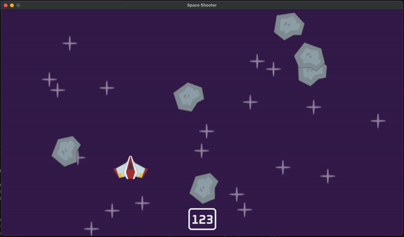

# Space Shooter Game

This is a simple space shooter game built in python.



## Features
- Uses `pygame-ce` for graphics and event handling.
- Modular and easy-to-understand code structure.
- Smooth player movement and shooting mechanics.
- Randomly spawning meteors with rotation and destruction effects.
- Explosion animations and sound effects.
- Score display based on survival time.

## Requirements
Ensure you have the following installed:
- Python 3.7 or higher
- `pygame-ce==2.5.2` (dependencies listed in `requirements.txt`)

## Installation

1. Clone the repository:
    ```sh
    git clone https://github.com/tehuanmelo/space_shooter.git
    cd space_shooter
    ```

2. Create a virtual environment and activate it:
    ```sh
    python3 -m venv .venv
    source .venv/bin/activate
    ```

3. Install the required dependencies:
    ```sh
    pip install -r requirements.txt
    ```

## Running the Game

To run the game, execute the following command:
```sh
python3 code/main.py
```

### Controls

- **Arrow Keys**: Move the player
- **Space**: Shoot Laser
- **Escape**: Quit the game

### Code Overview

The main game logic is contained in [main.py](code/main.py). Below is an explanation of the code:

### Explanation

- **Initialization**: The game initializes Pygame and sets up the display surface with a specified width and height.
- **Loading Assets**: Images for the player, stars, meteors, and lasers are loaded and converted to a format suitable for Pygame. Sound effects and music are also loaded.
- **Event Loop**: The main game loop runs while the `running` variable is `True`. It handles events such as quitting the game, pressing the escape key, and spawning meteors.
- **Player Movement**: The player’s direction is determined by the arrow keys, and the player’s position is updated accordingly.
- **Shooting Mechanic**: The player can shoot lasers by pressing the space key, with a delay between shots.
- **Meteor Spawning**: Meteors are spawned at random positions at the top of the screen and move downwards with rotation.
- **Collision Detection**: Collisions between the player, lasers, and meteors are detected and handled, including playing explosion sounds and animations.
- **Drawing Sprites**: The display surface is filled with a background color, and all game sprites (stars, meteors, lasers, player) are drawn on the screen.
- **Score Display**: The score, based on survival time, is displayed on the screen.
- **Updating the Display**: The display is updated to reflect the changes made during each iteration of the game loop.

## Contributing

Contributions are welcome! Please open an issue or submit a pull request.